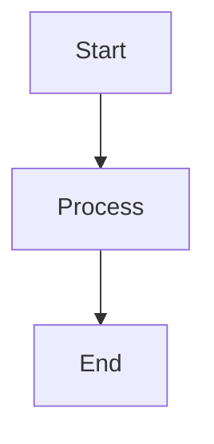
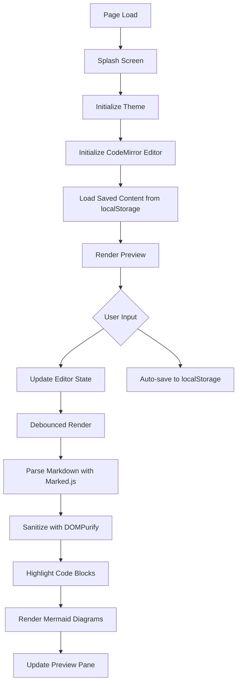
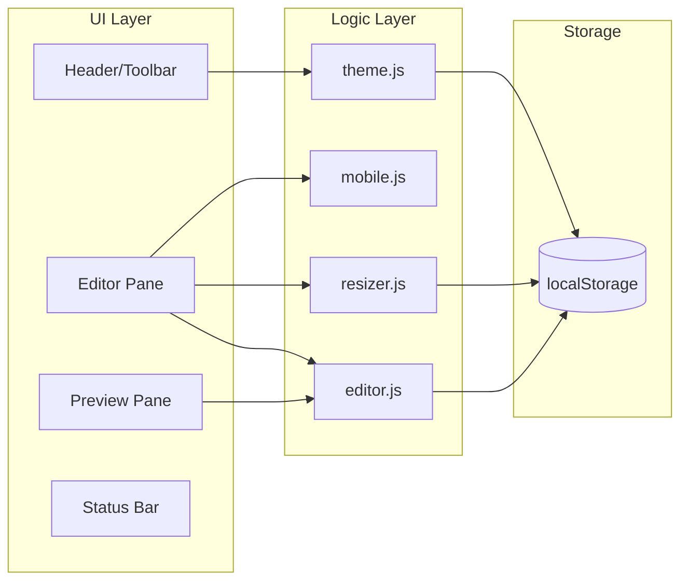

# MarkShare - Markdown Viewer & Editor

A modern, feature-rich web-based Markdown editor with live preview, designed for a seamless writing and documentation experience.


## 📖 Table of Contents

- [Overview](#overview)
- [Features](#features)
- [Demo](#demo)
- [Project Structure](#project-structure)
- [Installation](#installation)
- [Usage](#usage)
- [Keyboard Shortcuts](#keyboard-shortcuts)
- [Technology Stack](#technology-stack)
- [Architecture](#architecture)
- [Customization](#customization)
- [Browser Support](#browser-support)
- [Contributing](#contributing)
- [License](#license)

---

## Overview

MarkShare is a lightweight, single-page Markdown editor built with modern web technologies. It provides a clean, distraction-free writing environment with real-time preview, syntax highlighting, and support for advanced features like Mermaid diagrams and embedded videos.

The application follows a **design system approach** with CSS custom properties (variables) for consistent theming, supporting both dark and light modes out of the box.

---

## Features

### ✨ Core Features

| Feature                  | Description                                            |
| ------------------------ | ------------------------------------------------------ |
| **Live Preview**         | Real-time Markdown rendering as you type               |
| **Split View**           | Side-by-side editor and preview panes                  |
| **Syntax Highlighting**  | Code blocks highlighted with highlight.js              |
| **Mermaid Diagrams**     | Render flowcharts, sequence diagrams, and more         |
| **Dark/Light Theme**     | Toggle between themes with system preference detection |
| **Auto-Save**            | Content persisted to localStorage automatically        |
| **Word/Character Count** | Real-time statistics in the status bar                 |

### 📁 File Operations

- **Open** - Load `.md` or `.txt` files from your computer
- **Save** - Download your Markdown document
- **Export HTML** - Generate a self-contained HTML file
- **Print/PDF** - Print-friendly layout for PDF generation

### 🎨 View Modes

- **Editor Only** - Focus on writing
- **Split View** - Default side-by-side layout
- **Preview Only** - See the final rendered output

### 📱 Responsive Design

- Desktop: Full split-pane experience with resizable panels
- Mobile: Tab-based switching between editor and preview

### 🔧 Editor Toolbar

Quick formatting buttons for:

- **Bold** text
- _Italic_ text
- [Links](url)
- Code blocks
- Mermaid diagrams
- Images
- Videos

---

## Demo

Open [`index.html`](index.html) in a modern web browser to start using MarkShare immediately.

---

## Project Structure

```
MarkShare/
├── index.html          # Main application entry point
├── README.md           # This documentation file
│
├── Assests/            # Static assets
│   ├── logo.svg        # Application logo
│   └── markShare.svg   # Branding graphic
│
├── css/
│   ├── style.css       # Design tokens, themes, component styles
│   └── layout.css      # Application layout & responsive rules
│
└── js/
    ├── editor.js       # CodeMirror 6 editor initialization & core logic
    ├── theme.js        # Theme toggle & persistence
    ├── resizer.js      # Split pane resize functionality
    └── mobile.js       # Mobile view toggle logic
```

---

## Installation

### Quick Start

1. **Clone or download** this repository
2. **Open** [`index.html`](index.html) in a web browser

No build process or server required! The application runs entirely in the browser.

### Local Development

For local development with live reload, you can use any static file server:

```bash
# Using Python 3
python -m http.server 8000

# Using Node.js (npx)
npx serve .

# Using PHP
php -S localhost:8000
```

Then open `http://localhost:8000` in your browser.

---

## Usage

### Getting Started

1. **Launch** the application by opening [`index.html`](index.html)
2. **Start typing** Markdown in the editor pane
3. **See live preview** rendered in the right pane

### Opening Files

1. Click the **folder_open** icon in the toolbar
2. Select a `.md` or `.txt` file from your computer
3. The content loads into the editor

### Saving Your Work

- Click the **save** icon to download as `document.md`
- Content is also auto-saved to browser localStorage

### Exporting

- **Export HTML**: Creates a standalone HTML file with embedded styles
- **Print/PDF**: Opens browser print dialog for PDF generation

### Inserting Media

#### Images

```markdown

```

#### Videos

```markdown

```

#### Mermaid Diagrams

````markdown

````

---

## Keyboard Shortcuts

| Shortcut   | Action                 |
| ---------- | ---------------------- |
| `Ctrl + B` | **Bold** selected text |
| `Ctrl + I` | _Italic_ selected text |
| `Ctrl + K` | Insert [link](url)     |
| `Ctrl + S` | Save document          |

---

## Technology Stack

### Frontend Framework

- **Vanilla JavaScript** - No framework dependencies

### Editor

- **[CodeMirror 6](https://codemirror.net/)** - Modern, extensible code editor

### Markdown Processing

- **[Marked.js](https://marked.js.org/)** - Fast Markdown parser
- **[DOMPurify](https://github.com/cure53/DOMPurify)** - HTML sanitization for security

### Syntax Highlighting

- **[Highlight.js](https://highlightjs.org/)** - Code syntax highlighting

### Diagrams

- **[Mermaid](https://mermaid.js.org/)** - Diagram and flowchart generation

### Styling

- **[Normalize.css](https://necolas.github.io/normalize.css/)** - CSS reset
- **[Google Material Icons](https://fonts.google.com/icons)** - Icon set

### CDN Dependencies

All dependencies are loaded via CDN for zero-setup usage:

```html
<!-- Parser & Sanitizer -->
<script src="https://cdn.jsdelivr.net/npm/marked/marked.min.js"></script>
<script src="https://cdn.jsdelivr.net/npm/dompurify@3.0.9/dist/purify.min.js"></script>

<!-- Code Syntax Highlighting -->
<link
  rel="stylesheet"
  href="https://cdnjs.cloudflare.com/ajax/libs/highlight.js/11.8.0/styles/github-dark.min.css"
/>
<script src="https://cdnjs.cloudflare.com/ajax/libs/highlight.js/11.8.0/highlight.min.js"></script>

<!-- Mermaid Diagrams -->
<script src="https://cdn.jsdelivr.net/npm/mermaid@10.8.0/dist/mermaid.min.js"></script>

<!-- CodeMirror 6 (ES Modules) -->
<script type="module">
  import { EditorState } from "https://esm.sh/@codemirror/state@6.4.0";
  import { EditorView, basicSetup } from "https://esm.sh/codemirror@6.0.1";
  import { markdown } from "https://esm.sh/@codemirror/lang-markdown@6.2.5";
</script>
```

---

## Architecture

### Application Flow



### Component Architecture



### CSS Architecture

The styling follows a **design token** approach:

```css
/* Design Tokens (style.css) */
:root {
  --space-1: 4px;
  --font-sans: -apple-system, BlinkMacSystemFont, "Segoe UI", Roboto;
  --header-height: 56px;
  --transition-fast: 0.15s ease-in-out;
}

/* Theme Tokens */
:root[data-theme="light"] {
  --bg-primary: #ffffff;
  --text-primary: #18181b;
  --accent-color: #3b82f6;
}

:root[data-theme="dark"] {
  --bg-primary: #18181b;
  --text-primary: #f4f4f5;
  --accent-color: #3b82f6;
}
```

---

## Customization

### Changing Theme Colors

Edit the CSS custom properties in [`css/style.css`](css/style.css):

```css
:root[data-theme="dark"] {
  --accent-color: #your-color;
  --bg-primary: #your-background;
}
```

### Adding New Toolbar Buttons

1. Add button HTML in [`index.html`](index.html)
2. Add event listener in [`js/editor.js`](js/editor.js)

### Modifying Editor Behavior

The CodeMirror configuration is in [`js/editor.js`](js/editor.js:151-162):

```javascript
const view = new EditorView({
  state: EditorState.create({
    doc: initialDoc,
    extensions: [basicSetup, markdown(), customTheme, updateListener],
  }),
  parent: container,
});
```

---

## Browser Support

| Browser | Support          |
| ------- | ---------------- |
| Chrome  | ✅ Full support  |
| Firefox | ✅ Full support  |
| Safari  | ✅ Full support  |
| Edge    | ✅ Full support  |
| IE11    | ❌ Not supported |

### Requirements

- ES6 Modules support
- CSS Custom Properties support
- Flexbox support
- Dialog element support

---

## Security

MarkShare uses **DOMPurify** to sanitize HTML output, preventing XSS attacks from malicious Markdown content. The sanitizer is configured to allow:

- Standard HTML elements
- `video` and `source` tags for embedded videos
- Safe attributes (`controls`, `src`, `style`)

---

## Performance

- **Debounced rendering** (300ms) prevents excessive re-renders
- **Lazy loading** of Mermaid diagrams
- **Efficient scroll sync** using percentage-based mapping
- **LocalStorage caching** for instant content restoration

---

## Contributing

Contributions are welcome! Please feel free to submit issues and pull requests.

### Development Guidelines

1. Follow the existing code style
2. Test in multiple browsers
3. Update documentation for new features
4. Keep the application zero-dependency for deployment

---

## License

This project is open source. Feel free to use, modify, and distribute as needed.

---

## Acknowledgments

- [CodeMirror](https://codemirror.net/) for the excellent editor
- [Marked.js](https://marked.js.org/) for fast Markdown parsing
- [Mermaid](https://mermaid.js.org/) for diagram support
- [Google Material Icons](https://fonts.google.com/icons) for the icon set

---

_Built with ❤️ for the Markdown community_
