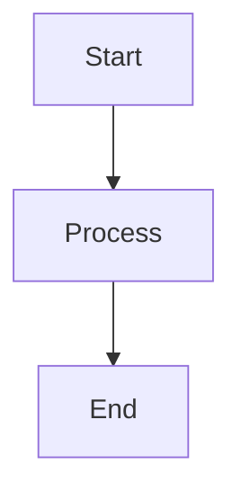
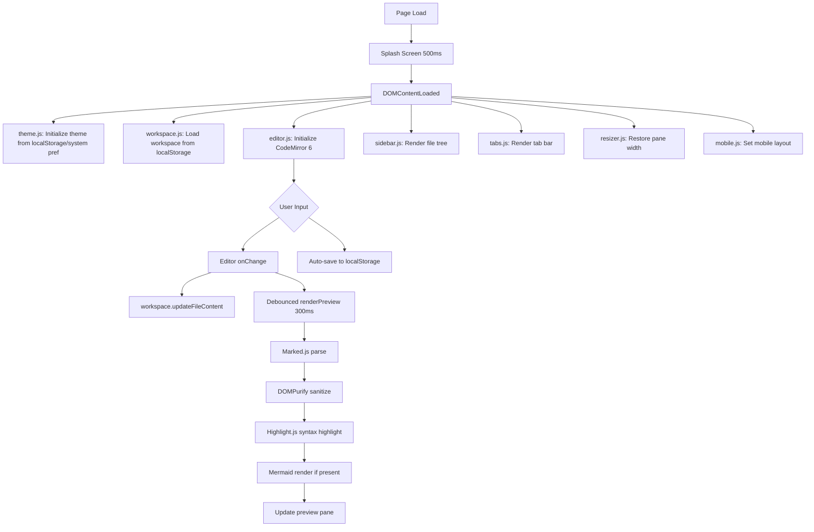
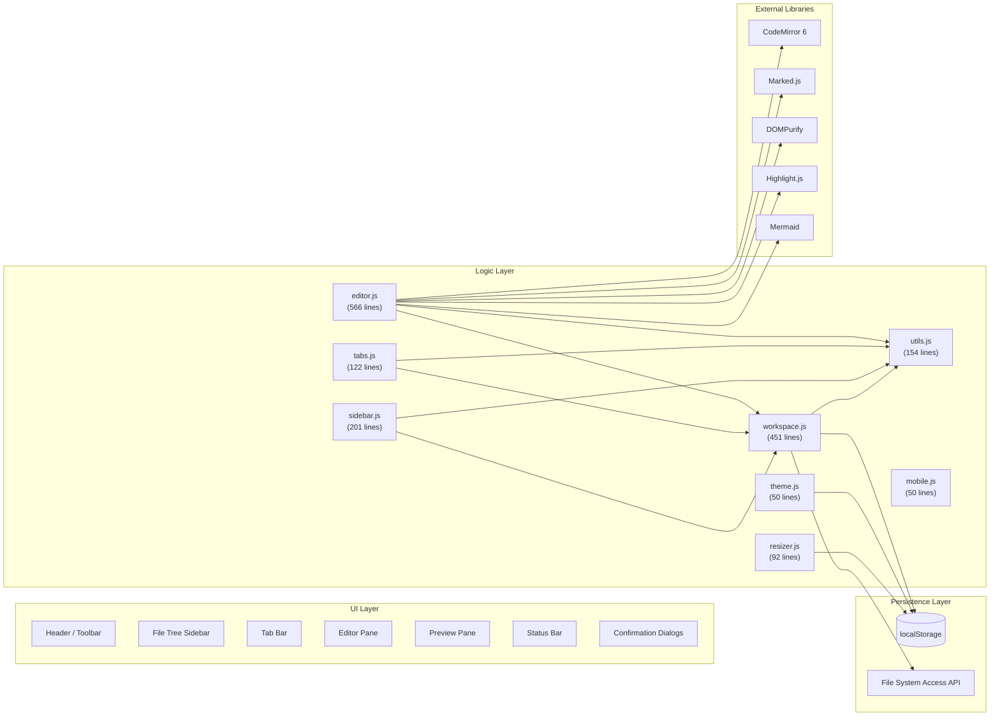

# MarkShare - Markdown Viewer & Editor

A modern, feature-rich web-based Markdown editor with live preview, designed for a seamless writing and documentation experience.


## Table of Contents

- [MarkShare - Markdown Viewer \& Editor](#markshare---markdown-viewer--editor)
  - [Table of Contents](#table-of-contents)
  - [Overview](#overview)
    - [Key Highlights](#key-highlights)
  - [Live Demo](#live-demo)
  - [Features](#features)
    - [Core Editor](#core-editor)
    - [Multi-File Workspace](#multi-file-workspace)
    - [File Operations](#file-operations)
    - [View Modes](#view-modes)
    - [Editor Toolbar](#editor-toolbar)
    - [Responsive Design](#responsive-design)
    - [UI Components](#ui-components)
  - [Project Structure](#project-structure)
    - [Module Descriptions](#module-descriptions)
  - [Installation \& Setup](#installation--setup)
    - [Quick Start](#quick-start)
    - [Local Development](#local-development)
    - [Production Build](#production-build)
  - [Usage Guide](#usage-guide)
    - [Getting Started](#getting-started)
    - [Working with Files](#working-with-files)
      - [Opening Files](#opening-files)
      - [Saving Your Work](#saving-your-work)
      - [Closing Files](#closing-files)
    - [Opening Folders](#opening-folders)
    - [Navigating Links](#navigating-links)
    - [Inserting Media](#inserting-media)
      - [Images](#images)
      - [Videos](#videos)
      - [Mermaid Diagrams](#mermaid-diagrams)
    - [Exporting \& Printing](#exporting--printing)
  - [Keyboard Shortcuts](#keyboard-shortcuts)
  - [Technology Stack](#technology-stack)
    - [Core](#core)
    - [Editor](#editor)
    - [Markdown Processing](#markdown-processing)
    - [Syntax Highlighting \& Diagrams](#syntax-highlighting--diagrams)
    - [Styling \& UI](#styling--ui)
    - [CDN Dependencies](#cdn-dependencies)
    - [ES Module Dependencies](#es-module-dependencies)
  - [Architecture](#architecture)
    - [Application Flow](#application-flow)
    - [Module Architecture](#module-architecture)
    - [Event System](#event-system)
    - [Workspace \& Tab Model](#workspace--tab-model)
    - [CSS Design System](#css-design-system)
  - [Customization](#customization)
    - [Changing Theme Colors](#changing-theme-colors)
    - [Adding New Toolbar Buttons](#adding-new-toolbar-buttons)
    - [Adding New Sidebar Actions](#adding-new-sidebar-actions)
    - [Modifying Editor Behavior](#modifying-editor-behavior)
  - [Browser Support](#browser-support)
    - [Requirements](#requirements)
  - [Security](#security)
  - [Performance](#performance)
  - [Contributing](#contributing)
    - [Development Guidelines](#development-guidelines)
    - [Adding a New Feature](#adding-a-new-feature)
  - [License](#license)
  - [Acknowledgments](#acknowledgments)

---

## Overview

MarkShare is a lightweight, single-page Markdown editor built with modern web technologies. It provides a distraction-free writing environment with real-time preview, syntax highlighting, and support for advanced features like Mermaid diagrams, embedded videos, and multi-file workspace management.

The application follows a **design system approach** with CSS custom properties (variables) for consistent theming, supporting both dark and light modes with system preference detection.

### Key Highlights

- **Zero build step** — runs entirely in the browser, no bundler or server required
- **Multi-file workspace** — open entire folders and manage multiple Markdown files
- **Tabbed editing** — VS Code-style tab bar with open/close state separate from the file tree
- **File System Access API** — save files directly back to disk (Chrome/Edge)
- **Sidebar file explorer** — collapsible tree view of all workspace files
- **Auto-save to localStorage** — content persists across sessions
- **Print/PDF support** — clean print layout with dark mode overrides

---

## Live Demo

[](https://app.netlify.com/projects/markshare/deploys)

Open [`markshare.netlify.app`](https://markshare.netlify.app/) in a modern web browser to use MarkShare immediately.

**Source Code:** [GitHub Repository](https://github.com/MrImaginatory/MarkShare)

---

## Features

### Core Editor

| Feature | Description |
|---|---|
| **Live Preview** | Real-time Markdown rendering as you type (300ms debounce) |
| **Split View** | Side-by-side editor and preview panes with resizable gutter |
| **Syntax Highlighting** | Code blocks highlighted with [Highlight.js](https://highlightjs.org/) |
| **Mermaid Diagrams** | Render flowcharts, sequence diagrams, Gantt charts, and more |
| **Dark/Light Theme** | Toggle between themes with system preference detection |
| **Auto-Save** | Content persisted to `localStorage` automatically on every change |
| **Word/Character Count** | Real-time statistics in the status bar |
| **Synchronized Scrolling** | Editor and preview scroll positions stay in sync (toggleable) |

### Multi-File Workspace

| Feature | Description |
|---|---|
| **Open Folder** | Load an entire directory of `.md`/`.txt` files recursively via File System Access API |
| **Open Files** | Add individual files via file picker (supports multi-select) |
| **Sidebar Explorer** | Collapsible file tree showing all workspace files with folder hierarchy |
| **Tab Bar** | VS Code-style tabs — only opened files appear; closing a tab keeps the file in workspace |
| **Active File Tracking** | Visual indicators for the currently active file in sidebar and tab bar |
| **Modified Indicators** | Blue dot on sidebar items and tabs for unsaved changes |
| **Workspace Persistence** | Full workspace state (file list, open tabs, active file) saved to `localStorage` |
| **Relative Link Navigation** | Clicking `.md` links in preview opens the target file in a new tab |
| **Anchor Link Support** | Links like `guide.md#section` scroll to the matching heading |

### File Operations

| Operation | Description |
|---|---|
| **Save (`Ctrl+S`)** | Saves the active file via File System Access API, or downloads as fallback |
| **Save All (`Ctrl+Shift+S`)** | Saves all modified files to disk |
| **Open Folder** | Uses `showDirectoryPicker()` to browse and load a directory |
| **Open Files** | Standard file input for `.md` and `.txt` files |
| **Export HTML** | Generates a self-contained standalone HTML file with embedded styles |
| **Print/PDF** | Opens browser print dialog with a clean, print-optimized layout |
| **Clear All** | Clears the active file's content (with confirmation dialog) |
| **Clear Workspace** | Removes all files from the explorer (with confirmation dialog) |

### View Modes

| Mode | Description |
|---|---|
| **Editor Only** | Full-width editor pane for focused writing |
| **Split View** | Default side-by-side layout with resizable panes |
| **Preview Only** | Full-width rendered preview |

### Editor Toolbar

Quick formatting buttons in the editor pane header:

| Button | Action | Markdown Output |
|---|---|---|
| **Bold** | `Ctrl+B` | `**text**` |
| **Italic** | `Ctrl+I` | `*text*` |
| **Link** | `Ctrl+K` | `[text](url)` |
| **Code Block** | — | ` ``` ` block |
| **Mermaid** | — | ` ```mermaid ` block |
| **Image** | — | `` |
| **Video** | — | `` |
| **Clear** | — | Clears editor content |

### Responsive Design

- **Desktop (>768px):** Full split-pane experience with resizable panels, sidebar, and tab bar
- **Mobile (<=768px):** Tab-based switching between Editor and Preview; sidebar becomes a fixed overlay; resizer is hidden

### UI Components

- **Splash Screen:** Animated logo on app load (500ms duration with fade-out)
- **Header:** Logo, title, toolbar, GitHub link, and theme toggle
- **Sidebar:** Collapsible file explorer with folder expand/collapse, open/clear/add buttons
- **Tab Bar:** Scrollable tab strip with close buttons, "Close All" button, and "Add File" (+) button
- **Status Bar:** Shows active filename, modified status, and total file count
- **Toast Notifications:** Non-intrusive notifications for save/error events
- **Confirmation Dialogs:** Modal dialogs for destructive actions (clear content, clear workspace)

---

## Project Structure

```
MarkShare/
├── index.html              # Main application entry point
├── README.md               # This documentation file
├── plan.md                 # Development plan for tab/workspace separation
│
├── Assests/                # Static assets
│   ├── logo.svg            # Application logo (used in splash, navbar, favicon)
│   └── markShare.svg       # Branding graphic
│
├── css/
│   ├── style.css           # Design tokens, themes, component styles (871 lines)
│   ├── style.min.css       # Minified version (production)
│   ├── layout.css          # Application layout, responsive rules, print styles (302 lines)
│   └── layout.min.css      # Minified version (production)
│
└── js/
    ├── editor.js           # CodeMirror 6 initialization, preview rendering, file I/O, toolbar, shortcuts (566 lines)
    ├── editor.min.js       # Minified version (production)
    ├── workspace.js        # Multi-file workspace manager, persistence, File System Access API (451 lines)
    ├── workspace.min.js    # Minified version (production)
    ├── tabs.js             # Tab bar rendering and event handling (122 lines)
    ├── tabs.min.js         # Minified version (production)
    ├── sidebar.js          # File tree rendering, sidebar controls (201 lines)
    ├── sidebar.min.js      # Minified version (production)
    ├── utils.js            # Path utilities, file tree builder (154 lines)
    ├── utils.min.js        # Minified version (production)
    ├── theme.js            # Theme toggle, persistence, syntax highlight theme switching (50 lines)
    ├── theme.min.js        # Minified version (production)
    ├── resizer.js          # Split pane resize logic (mouse + touch) (92 lines)
    ├── resizer.min.js      # Minified version (production)
    ├── mobile.js           # Mobile view toggle logic (50 lines)
    └── mobile.min.js       # Minified version (production)
```

### Module Descriptions

| Module | Lines | Purpose |
|---|---|---|
| `editor.js` | 566 | Core application logic — CodeMirror 6 setup, Markdown preview rendering with Marked.js/DOMPurify, Mermaid diagram rendering, syntax highlighting, synchronized scrolling, keyboard shortcuts, toolbar event handlers, file open/save/export/print |
| `workspace.js` | 451 | Workspace singleton managing all file state — file Map, open tabs Set, active file tracking, localStorage persistence, File System Access API integration for folder open and disk save, legacy data migration |
| `tabs.js` | 122 | Tab bar UI — renders open tabs, handles tab click/switch/close, "Close All" and "Add File" buttons, listens for workspace events |
| `sidebar.js` | 201 | File tree sidebar — builds and renders hierarchical file tree, folder expand/collapse, file click opens tab, sidebar toggle/collapse, open folder/add files/clear workspace buttons |
| `utils.js` | 154 | Shared utilities — path normalization, relative path resolution, file/directory name extraction, relative `.md` link detection, fragment extraction, file tree builder |
| `theme.js` | 50 | Theme management — toggles dark/light mode, persists to localStorage, detects system preference, switches Highlight.js theme stylesheet |
| `resizer.js` | 92 | Split pane resizing — drag gutter to resize editor/preview panes, supports mouse and touch, persists pane width to localStorage |
| `mobile.js` | 50 | Mobile layout — switches between Editor/Preview tabs on small screens, handles window resize |

---

## Installation & Setup

### Quick Start

1. **Clone or download** this repository
2. **Open** [`index.html`](index.html) in a web browser

No build process, package manager, or server required. The application runs entirely in the browser.

### Local Development

For local development with live reload, use any static file server:

```bash
# Using Python 3
python -m http.server 8000

# Using Node.js (npx)
npx serve .

# Using PHP
php -S localhost:8000
```

Then open `http://localhost:8000` in your browser.

### Production Build

The repository includes both source (`.js`, `.css`) and minified (`.min.js`, `.min.css`) files. The production `index.html` loads the minified versions. To regenerate minified files:

```bash
# Install a minifier (e.g., uglify-js, clean-css-cli)
npm install -g uglify-js clean-css-cli

# Minify JavaScript
uglifyjs js/editor.js -o js/editor.min.js
uglifyjs js/workspace.js -o js/workspace.min.js
uglifyjs js/tabs.js -o js/tabs.min.js
uglifyjs js/sidebar.js -o js/sidebar.min.js
uglifyjs js/utils.js -o js/utils.min.js
uglifyjs js/theme.js -o js/theme.min.js
uglifyjs js/resizer.js -o js/resizer.min.js
uglifyjs js/mobile.js -o js/mobile.min.js

# Minify CSS
cleancss -o css/style.min.css css/style.css
cleancss -o css/layout.min.css css/layout.css
```

---

## Usage Guide

### Getting Started

1. **Launch** the application by opening [`index.html`](index.html) or visiting the live demo
2. The **splash screen** shows the logo for 500ms while the app initializes
3. A **welcome document** is loaded by default with browser compatibility information
4. **Start typing** Markdown in the editor pane
5. **See live preview** rendered in the right pane

### Working with Files

#### Opening Files

- Click the **folder_open** icon in the toolbar to open a folder (Chrome/Edge)
- Click the **note_add** icon to open individual `.md` or `.txt` files (supports multi-select)
- Files appear in the sidebar and can be opened as tabs by clicking them

#### Saving Your Work

- Click the **save** icon (`Ctrl+S`) to save the active file
  - If opened via File System Access API, saves directly to disk
  - Otherwise, downloads as `filename.md`
- Click **save_as** icon (`Ctrl+Shift+S`) to save all modified files
- Content is also auto-saved to `localStorage` on every edit

#### Closing Files

- Click the **×** button on a tab to close it (file remains in workspace)
- Click the "Close All" button (× icon in tab bar) to close all tabs
- Use the sidebar "Clear All Files" button (trash icon) to remove everything

### Opening Folders

1. Click the **folder_open** icon in the toolbar or sidebar
2. Select a directory using the system folder picker
3. All `.md` and `.txt` files are loaded recursively (skipping hidden directories)
4. The sidebar shows the folder structure
5. `index.md` or `README.md` is auto-opened if present; otherwise the first file

> **Note:** Folder browsing requires the [File System Access API](https://developer.mozilla.org/en-US/docs/Web/API/File_System_Access_API), available in Chrome and Edge. Firefox and Safari users can open individual files instead.

### Navigating Links

Internal Markdown links in the preview pane are clickable:

- **Relative links** like `[Guide](guide.md)` open the target file in a new tab
- **Anchor links** like `[API](api.md#section)` open the file and scroll to the heading
- **Same-file anchors** like `[See below](#section)` scroll to the heading in the current file
- **External links** (https://...) open in a new browser tab as normal

### Inserting Media

#### Images

```markdown

```

#### Videos

```markdown

```

Videos are rendered as HTML5 `<video>` elements with controls.

#### Mermaid Diagrams

````markdown

```mermaid
graph TD
    A[Start] --> B[Process]
    B --> C[End]
```
````

Supported Mermaid diagram types: flowchart, sequence, Gantt, class, state, ER, pie, and more.

### Exporting & Printing

- **Export HTML:** Creates a standalone `.html` file with embedded styles and rendered content
- **Print/PDF:** Opens the browser print dialog. The layout hides the editor, toolbar, sidebar, and footer. Dark mode is automatically converted to light mode for printing.

---

## Keyboard Shortcuts

| Shortcut | Action |
|---|---|
| `Ctrl + B` | **Bold** selected text |
| `Ctrl + I` | *Italic* selected text |
| `Ctrl + K` | Insert [link](url) |
| `Ctrl + S` | Save active file |
| `Ctrl + Shift + S` | Save all modified files |

---

## Technology Stack

### Core

| Technology | Purpose |
|---|---|
| **Vanilla JavaScript (ES6+)** | Application logic — no framework dependencies |
| **ES Modules** | Module system for `editor.js`, `workspace.js`, `tabs.js`, `sidebar.js`, `utils.js` |

### Editor

| Library | Purpose |
|---|---|
| **[CodeMirror 6](https://codemirror.net/)** | Modern, extensible code editor with Markdown language support |

### Markdown Processing

| Library | Purpose |
|---|---|
| **[Marked.js](https://marked.js.org/)** | Fast Markdown-to-HTML parser |
| **[DOMPurify](https://github.com/cure53/DOMPurify)** | HTML sanitization to prevent XSS attacks |

### Syntax Highlighting & Diagrams

| Library | Purpose |
|---|---|
| **[Highlight.js](https://highlightjs.org/)** | Code syntax highlighting with theme switching |
| **[Mermaid](https://mermaid.js.org/)** | Diagram and flowchart generation from text |

### Styling & UI

| Library | Purpose |
|---|---|
| **[Normalize.css](https://necolas.github.io/normalize.css/)** | CSS reset for cross-browser consistency |
| **[Google Material Icons](https://fonts.google.com/icons)** | Icon set for toolbar and UI elements |
| **[Material Symbols](https://fonts.google.com/icons)** | Additional icon for HTML export button |

### CDN Dependencies

All dependencies are loaded via CDN for zero-setup usage:

```html
<!-- CSS Reset -->
<link rel="stylesheet" href="https://cdn.jsdelivr.net/npm/normalize.css@8.0.1/normalize.min.css">

<!-- Markdown Parser & HTML Sanitizer -->
<script defer src="https://cdn.jsdelivr.net/npm/marked/marked.min.js"></script>
<script defer src="https://cdn.jsdelivr.net/npm/dompurify@3.0.9/dist/purify.min.js"></script>

<!-- Code Syntax Highlighting -->
<link rel="stylesheet" href="https://cdnjs.cloudflare.com/ajax/libs/highlight.js/11.8.0/styles/github-dark.min.css" id="hljs-theme">
<script defer src="https://cdnjs.cloudflare.com/ajax/libs/highlight.js/11.8.0/highlight.min.js"></script>

<!-- Icons -->
<link rel="stylesheet" href="https://fonts.googleapis.com/icon?family=Material+Icons&display=swap">
<link rel="stylesheet" href="https://fonts.googleapis.com/css2?family=Material+Symbols+Outlined:opsz,wght,FILL,GRAD@24,400,0,0&icon_names=html&display=swap">
```

### ES Module Dependencies

CodeMirror 6 is loaded via [esm.sh](https://esm.sh/) CDN:

```javascript
import { EditorState } from "https://esm.sh/@codemirror/state@6.4.0";
import { EditorView, basicSetup } from "https://esm.sh/codemirror@6.0.1?deps=@codemirror/state@6.4.0";
import { markdown } from "https://esm.sh/@codemirror/lang-markdown@6.2.5?deps=@codemirror/state@6.4.0";
```

Mermaid is lazily loaded (only when a Mermaid code block is encountered):

```javascript
const mermaidModule = await import("https://cdn.jsdelivr.net/npm/mermaid@10/dist/mermaid.esm.min.mjs");
```

---

## Architecture

### Application Flow


```mermaid
flowchart TD
    A[Page Load] --> B[Splash Screen 500ms]
    B --> C[DOMContentLoaded]
    C --> D[theme.js: Initialize theme from localStorage/system pref]
    C --> E[workspace.js: Load workspace from localStorage]
    C --> F[editor.js: Initialize CodeMirror 6]
    C --> G[sidebar.js: Render file tree]
    C --> H[tabs.js: Render tab bar]
    C --> I[resizer.js: Restore pane width]
    C --> J[mobile.js: Set mobile layout]

    F --> K{User Input}
    K --> L[Editor onChange]
    L --> M[workspace.updateFileContent]
    L --> N[Debounced renderPreview 300ms]
    N --> O[Marked.js parse]
    O --> P[DOMPurify sanitize]
    P --> Q[Highlight.js syntax highlight]
    Q --> R[Mermaid render if present]
    R --> S[Update preview pane]

    K --> T[Auto-save to localStorage]
```

### Module Architecture


```mermaid
flowchart LR
    subgraph UI["UI Layer"]
        Header[Header / Toolbar]
        Sidebar[File Tree Sidebar]
        TabBar[Tab Bar]
        EditorPane[Editor Pane]
        PreviewPane[Preview Pane]
        StatusBar[Status Bar]
        Dialogs[Confirmation Dialogs]
    end

    subgraph Logic["Logic Layer"]
        EditorJS["editor.js\n(566 lines)"]
        WorkspaceJS["workspace.js\n(451 lines)"]
        TabsJS["tabs.js\n(122 lines)"]
        SidebarJS["sidebar.js\n(201 lines)"]
        UtilsJS["utils.js\n(154 lines)"]
        ThemeJS["theme.js\n(50 lines)"]
        ResizerJS["resizer.js\n(92 lines)"]
        MobileJS["mobile.js\n(50 lines)"]
    end

    subgraph Storage["Persistence Layer"]
        LS[(localStorage)]
        FSA[File System Access API]
    end

    subgraph External["External Libraries"]
        CM[CodeMirror 6]
        Marked[Marked.js]
        DOMPurify[DOMPurify]
        HLJS[Highlight.js]
        Mermaid[Mermaid]
    end

    EditorJS --> CM
    EditorJS --> Marked
    EditorJS --> DOMPurify
    EditorJS --> HLJS
    EditorJS --> Mermaid
    EditorJS --> WorkspaceJS
    EditorJS --> UtilsJS
    TabsJS --> WorkspaceJS
    TabsJS --> UtilsJS
    SidebarJS --> WorkspaceJS
    SidebarJS --> UtilsJS
    WorkspaceJS --> UtilsJS
    WorkspaceJS --> LS
    WorkspaceJS --> FSA
    ThemeJS --> LS
    ResizerJS --> LS
```

### Event System

The application uses CustomEvents on `window` for inter-module communication:

| Event | Dispatched By | Listened By | Purpose |
|---|---|---|---|
| `workspace-changed` | `workspace.js` | `tabs.js`, `sidebar.js` | Files added/removed, tabs opened/closed, workspace loaded/cleared |
| `active-file-changed` | `workspace.js` | `editor.js`, `tabs.js`, `sidebar.js` | Active file switched (detail: `{ path }`) |
| `file-content-changed` | `workspace.js` | `tabs.js`, `sidebar.js` | File content modified (detail: `{ path }`) |
| `file-saved` | `workspace.js` | `editor.js`, `tabs.js`, `sidebar.js` | File saved to disk (detail: `{ path }`) |
| `workspace-error` | `workspace.js` | `editor.js` | Error occurred (detail: `{ message }`) |
| `theme-changed` | `theme.js` | `editor.js` | Theme toggled — triggers re-render of preview |

### Workspace & Tab Model

MarkShare separates the concept of **workspace files** from **open tabs** (similar to VS Code):

```
workspace.files       = Map<path, {content, name, path, handle, modified}>
workspace.openTabs    = Set<path>  (files shown in tab bar)
workspace.activeFile  = string|null  (currently editing)
```

- **Sidebar** shows all files in `workspace.files`
- **Tab bar** shows only files in `workspace.openTabs`
- Clicking a file in sidebar calls `workspace.openTab(path)` + `workspace.setActiveFile(path)`
- Closing a tab calls `workspace.closeTab(path)` — removes from tabs but keeps in workspace
- All state is persisted to `localStorage` under keys:
  - `fotg-workspace` — workspace metadata (file paths, open tabs, root name)
  - `fotg-file:{path}` — individual file content
  - `fotg-active-file` — active file path
  - `fotg-pane-width` — editor pane width
  - `theme` — selected theme

### CSS Design System

The styling uses CSS custom properties for a consistent design token system:

```css
/* Design Tokens (style.css) */
:root {
  --space-1: 4px;   --space-2: 8px;   --space-3: 12px;
  --space-4: 16px;  --space-5: 24px;  --space-6: 32px;

  --font-sans: -apple-system, BlinkMacSystemFont, "Segoe UI", Roboto, ...;
  --font-mono: ui-monospace, SFMono-Regular, SF Mono, Menlo, Consolas, ...;

  --transition-fast: 0.15s ease-in-out;
  --transition-medium: 0.3s ease-in-out;

  --header-height: 56px;
  --footer-height: 32px;

  --radius-sm: 0.3rem;  --radius-md: 0.5rem;
  --radius-lg: 0.75rem; --radius-xl: 1rem;
}

/* Theme tokens */
:root[data-theme="light"] {
  --bg-primary: #ffffff;   --text-primary: #18181b;
  --accent-color: #3b82f6; --border-color: #e4e4e7;
}

:root[data-theme="dark"] {
  --bg-primary: #18181b;   --text-primary: #f4f4f5;
  --accent-color: #3b82f6; --border-color: #27272a;
}
```

---

## Customization

### Changing Theme Colors

Edit the CSS custom properties in [`css/style.css`](css/style.css):

```css
:root[data-theme="dark"] {
  --accent-color: #your-color;
  --bg-primary: #your-background;
  --text-primary: #your-text-color;
}
```

### Adding New Toolbar Buttons

1. Add button HTML in [`index.html`](index.html) inside `#toolbar` or `.pane-header-toolbar`
2. Add event listener in [`js/editor.js`](js/editor.js)

### Adding New Sidebar Actions

1. Add button in [`index.html`](index.html) inside `.sidebar-header-actions`
2. Add event listener in [`js/sidebar.js`](js/sidebar.js)

### Modifying Editor Behavior

The CodeMirror configuration is in [`js/editor.js`](js/editor.js):

```javascript
const view = new EditorView({
  state: EditorState.create({
    doc: initialDoc,
    extensions: [
      basicSetup,      // Line numbers, bracket matching, etc.
      markdown(),       // Markdown language support
      customTheme,      // Theme-aware editor styling
      updateListener    // Change detection for preview + save
    ]
  }),
  parent: container
});
```

---

## Browser Support

| Browser | Support | Notes |
|---|---|---|
| Chrome 86+ | Full | File System Access API supported |
| Edge 86+ | Full | File System Access API supported |
| Firefox 110+ | Partial | No File System Access API — file open/download fallback |
| Safari 15.4+ | Partial | No File System Access API — file open/download fallback |

### Requirements

- ES6 Modules support (`<script type="module">`)
- CSS Custom Properties support
- Flexbox support
- `<dialog>` element support (or polyfill)

---

## Security

- **DOMPurify** sanitizes all rendered HTML to prevent XSS attacks from malicious Markdown content
- The sanitizer allows: standard HTML elements, `<video>` and `<source>` tags, safe attributes (`controls`, `src`, `style`)
- External links are rendered with standard `<a>` tags — users should exercise caution with unknown URLs
- File System Access API requires explicit user permission for each folder/file access

---

## Performance

| Optimization | Implementation |
|---|---|
| **Debounced rendering** | 300ms delay prevents excessive re-renders during typing |
| **Lazy Mermaid loading** | Mermaid library is loaded only when a diagram block is encountered |
| **Efficient scroll sync** | Percentage-based scroll mapping between editor and preview |
| **LocalStorage caching** | Instant content restoration on page reload |
| **Minified assets** | Production uses `.min.css` and `.min.js` files |
| **Deferred script loading** | `defer` attribute on non-module scripts |
| **Conditional Mermaid re-init** | Mermaid is re-initialized per render only if already loaded |

---

## Contributing

Contributions are welcome! Please feel free to submit issues and pull requests.

### Development Guidelines

1. Follow the existing code style and naming conventions
2. Test in multiple browsers (Chrome, Firefox, Safari, Edge)
3. Update documentation for new features
4. Keep the application zero-dependency for deployment (all deps via CDN)
5. Regenerate minified files after making changes to source files
6. Use the event system for inter-module communication — avoid direct cross-module imports where possible

### Adding a New Feature

1. Identify which module(s) need changes
2. If adding new events, document them in the [Event System](#event-system) section
3. Update both source and minified files
4. Test persistence (localStorage) and edge cases
5. Update this README

---

## License

This project is open source. Feel free to use, modify, and distribute as needed.

---

## Acknowledgments

- [CodeMirror](https://codemirror.net/) for the excellent code editor
- [Marked.js](https://marked.js.org/) for fast Markdown parsing
- [DOMPurify](https://github.com/cure53/DOMPurify) for HTML sanitization
- [Highlight.js](https://highlightjs.org/) for syntax highlighting
- [Mermaid](https://mermaid.js.org/) for diagram support
- [Google Material Icons](https://fonts.google.com/icons) for the icon set
- [Normalize.css](https://necolas.github.io/normalize.css/) for CSS consistency

---

_Built with ❤️ for the Markdown community_
